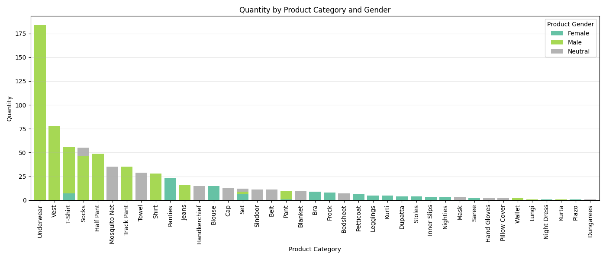

+++
title = 'Retail Clothing Store Data Analysis'
date = 2025-05-06T03:18:12+05:30
draft = false
toc = true
tocBorder = true
+++

## Introduction

One fine evening while I was out walking, I thought—why not record data from an offline retail clothing store and do some data analysis? I’m currently learning data analysis, and I wanted to actually _use_ my knowledge, try stuff out, and hopefully learn something new. This report is the journey of me going from data collection all the way to analysis.

After finishing everything, I can confidently say that my domain knowledge helped a lot during both the data collection and analysis process. It was honestly the main reason I could come up with the right questions to ask and actually answer them in a meaningful way. That domain knowledge came from me working in the shop for a few months, so I had some idea of how things worked on the ground.

This whole process also introduced me to the pain points of collecting data—like how important it is to collect it properly, and how missing small but important stuff can mess up the analysis later. I even had to go back at one point to collect extra data that I initially missed. (More on that later in the analysis section.)

Just a heads-up: this report isn’t split cleanly into "data collection" and "analysis" sections. I’ve written it based on the actual timeline of how I worked on it. So yeah, I’ll be jumping back and forth between collecting more data, analysing it, and fixing stuff, because that’s how things naturally flowed—and honestly, it makes it more readable for me.

Anyway, before diving into the analysis, I obviously need data to work with. The data here is about daily sales of products from a small offline retail clothing store. I’m trying to spot patterns that I can maybe use to help improve revenue growth. There’s a bit of nuance to what I mean by "revenue growth," which I’ll explain more in the analysis phase.

## Data Collection

I remember the first time I went to ask if I could collect data from their shop, and they were like, _“Why do you want it?”_ The only reason I could come up with was that I needed it for a data project I’m working on, and I wanted to use that project to apply for internships (which is actually true). Thankfully, they were kind enough to share details about all the sales they made.

One good thing they already did was keep a daily record of prices for everything they sold. This helped them calculate total daily sales, and it also helped me because it jogged their memory about what was sold just by looking at the numbers written down.

Also, I’m pretty close with the shop owner since I worked there for a few months. That’s the only reason I even had the guts to go ask for the data—_every single day_. Yep, every day by around 10:30 PM, I’d go to the shop, note the sales data on paper, and then come home and type everything into a spreadsheet by hand.

Here’s one from the very first day of data collection: 26th March 2025.


Yeah, it’s kind of lame—I just wrote the price, the product they sold at that price, and other stuff like size, quantity, and unit price. It was super manual, and at the end of each day, I had to sit and transfer it all to a spreadsheet.

You’ll notice I also added some extra metadata. For example, the time of sale is fuzzy if the payment was in cash because the shop owner couldn’t always remember exactly when each item was sold. But for online payments, I could get the exact time from the UPI business partner app.

Another thing: since this is a small, unbranded clothing store, bargaining is a regular thing. So you'll notice that the unit prices vary even for the same product. But there’s a range, and if the price goes outside that, the sale usually doesn’t happen—the customer just walks out.

Initially, I thought I’d record everything on my phone and send it to my workstation, but typing on the phone was painfully slow. I didn’t want to annoy them too much (which I already kinda did by asking them to repeat things two or three times), so I just stuck to good ol’ pen and paper.

Once home, I wrote the data into a spreadsheet. These are the columns I decided to use:

```
InvoiceNo -> to aggregate single transaction (ranges from 1 to last)
Clothes Description -> product detail
Size
Quantity
Unit Price
Payment Mode -> Online (UPI) | Cash
Payment Date  -> used payment date and time as that time the payment
Payment Time  -> was done and deal was finalized
```

I didn’t know what kinds of products would be sold in the future, so I kept the structure general. I didn’t want to keep adding or removing columns every other day.

Now, this whole data collection process was very manual—and I honestly hate that about it. I don’t yet know how I’d improve it, but if I could get digital data, I could at least use Python scripts to format it however I want.

Since most of this data was based on the shopkeeper’s memory (especially for cash sales), there are two main sources of error:

1. **Time errors** for cash payments, and
2. **Size field errors**, since they didn’t initially note down sizes in their records. But that second issue got better after a few days—once they realised I was serious about this, they started writing down sizes too.

I collected data like this for about 30 days before I jumped into the analysis.

## Data Cleaning and Feature Engineering

I analysed the data using Python and its libraries in a Jupyter Notebook. First, here are the libraries I used:

```python
import numpy as np
import pandas as pd
import matplotlib.pyplot as plt
import matplotlib.dates as mdates
import matplotlib.ticker as ticker
import seaborn as sns

# i have not used but included it because
# i tried something with it
from sklearn.cluster import KMeans

# to format number into showing in currency format
import locale
locale.setlocale(locale.LC_MONETARY, 'en_IN')
format_currency = lambda x: locale.currency(x, grouping=True)

# to have some space between markdown and python cell
# otherwise they feel quite congested
from IPython.display import display, HTML

css = """
<style>
    .jp-Notebook .jp-Cell {
        margin-bottom: 16px !important;
    }
</style>
"""

display(HTML(css))
```

Then I imported the data and did some initial cleaning and feature engineering, especially focused on the product description field.

```python
df = pd.read_csv("data.csv")

final_df = df.copy()

# combining date and time to create datetime
final_df["PaymentDateTime"] = pd.to_datetime(final_df["PaymentDate"] + " " + final_df["PaymentTime"])
final_df = final_df.drop(columns=["PaymentDate", "PaymentTime"])
```

I also manually cleaned up the `Description` field. Some descriptions were inconsistent, so I fixed them in the spreadsheet itself, but this is the code I used to identify and fix common issues:

```python
"""
final_df["Description"] = final_df["Description"].str.replace("1 Year", "Baby")
final_df["Description"] = final_df["Description"].str.replace("Peti Coat", "Petticoat")
final_df["Description"] = final_df["Description"].str.replace("Purple White", "Purple")
final_df["Description"] = final_df["Description"].str.replace("Bed Sheet", "Bedsheet")
final_df["Description"] = final_df["Description"].str.replace("Half Pants", "Half Pant")
final_df["Description"] = final_df["Description"].str.replace("Track Pants", "Track Pant")
final_df["Description"] = final_df["Description"].str.replace("Pants", "Pant")
final_df["Description"] = final_df["Description"].str.replace("Shirt + Jeans", "Shirt + Jeans Set")
final_df["Description"] = final_df["Description"].str.replace("T-Shirt + Track Pant", "T-Shirt + Track Pant Set")
"""
```

After that, I explored all the unique product descriptions to figure out what kinds of structured features I could extract.

```python
set([row for _, row in final_df["Description"].items()])
```

From there, I decided to extract the following fields:

- Product Colour
- Product Category
- Product Company
- Product Gender
- Product Age Group
- Product Details (any leftover text not captured above)

Since I had already manually reviewed the descriptions, I created lists of common values for each of these categories and wrote a function to extract them:

```python
def description_feature_engineering(desc_string):
    # first colour of product
    colors = ["Black", "Blue", "Dark Green", "Brown", "Grey", "Purple", "White", "Red"]
    matched_color = None
    for color in colors:
        if color in desc_string:
            matched_color = color
            desc_string = desc_string.replace(matched_color, "")
            break

    # gender and age group
    matched_gender = None
    matched_agegroup = None
    if "Girl" in desc_string:
        matched_gender = "Female"
        matched_agegroup = "Girl"
        desc_string = desc_string.replace(matched_agegroup, "")
    elif "Ladies" in desc_string:
        matched_gender = "Female"
        matched_agegroup = "Ladies"
        desc_string = desc_string.replace(matched_agegroup, "")
    elif "Boy" in desc_string:
        matched_gender = "Male"
        matched_agegroup = "Boy"
        desc_string = desc_string.replace(matched_agegroup, "")
    elif "Mens" in desc_string:
        matched_gender = "Male"
        matched_agegroup = "Mens"
        desc_string = desc_string.replace(matched_agegroup, "")
    elif "Men" in desc_string:
        matched_gender = "Male"
        matched_agegroup = "Mens"
        desc_string = desc_string.replace(matched_agegroup, "")

    if "Baby" in desc_string:
        matched_agegroup = "Baby"
        desc_string = desc_string.replace(matched_agegroup, "")
    elif "Child" in desc_string or "Kids" in desc_string or "Little" in desc_string:
        matched_agegroup = "Kids"
        desc_string = desc_string.replace(matched_agegroup, "")

    # company string
    companies = ["Adidas", "Ajanta", "Cotton Candy", "ESSA", "Eco Brand", "Evo",
                 "Foggy", "Gem", "Lux Cozi", "Lux Venus", "Macho", "Nike", "Selsia",
                 "Speed", "Stant", "Pooja Brand"]
    matched_company = None
    for company in companies:
        if company in desc_string:
            matched_company = company
            desc_string = desc_string.replace(matched_company, "")
            break

    # category field
    categories = [
        "Handkerchief", "Socks", "Belt", "Cap", "Dungarees", "Frock", "Mask", "Towel", "Bedsheet",
        "T-Shirt", "Shirt", "Track Pant", "Half Pant", "Pant", "Jeans", "Kurta", "Panties",
         "Leggings", "Plazo", "Underwear", "Inner Slips", "Hand Gloves", "Dupatta", "Blouse", "Bra", "Nighties",
         "Kurti", "Night Dress", "Petticoat", "Stoles", "Blanket", "Vest", "Wallet", "Pillow Cover", "Lungi",
         "Mosquito Net", "Saree", "Sindoor", "Set"
    ]
    matched_category = None
    matched_categories = []  # list as we have to handle more than one case
    for category in categories:
        if category in desc_string:
            matched_categories.append(category)

    if len(matched_categories) == 1:
        matched_category = matched_categories[0]
        desc_string = desc_string.replace(matched_categories[0], "")
    elif len(matched_categories) == 2:
        if "Set" in matched_categories:
            matched_category = "Set"
            desc_string = desc_string.replace(matched_category, "")
        elif "Jeans" in matched_categories and "Shirt" in matched_categories:
            matched_category = "Shirt"
            desc_string = desc_string.replace(matched_category, "")
        else:
            # handling cases like "T-Shirt" both Shirt and T-Shirt is matched
            # same for Pant and Panties
            bigger_cate = None
            smll_cate = None
            if len(matched_categories[0]) > len(matched_categories[1]):
                bigger_cate = matched_categories[0]
                smll_cate = matched_categories[1]
            else:
                bigger_cate = matched_categories[1]
                smll_cate = matched_categories[0]

            if smll_cate in bigger_cate:
                matched_category = bigger_cate
                desc_string = desc_string.replace(matched_category, "")
    elif len(matched_categories) > 2:
        if "Set" in matched_categories:
            matched_category = "Set"
            desc_string = desc_string.replace(matched_category, "")

    # details
    cleaned_details = ' '.join(desc_string.split())

    return [matched_color, matched_category, matched_company, cleaned_details, matched_gender, matched_agegroup]


features_df = final_df['Description'].apply(description_feature_engineering).apply(pd.Series)
features_df.columns = [
    "Product_Color", "Product_Category", "Product_Company", "Product_Details", "Product_Gender", "Product_AgeGroup"
]
final_df = pd.concat([final_df, features_df], axis=1)
```

Some entries didn’t have gender mentioned, even though they were obvious (like "Black Shirt" being for men—since I know they only stock that for men). So I filled in missing gender and age group fields based on known product categories.

```python
# Here i am assigning all the T-Shirt to Male gender even though there are Ladies T-Shirt but still since there are alot of Male customer than Ladies customer. So having one to two error won't impact the overall analysis.
# check below why i am able to say there are more mens customer than ladies customer
male_categories = ["T-Shirt", "Shirt", "Track Pant", "Half Pant", "Pant", "Jeans", "Lungi"]
final_df.loc[
    (final_df["Product_Category"].isin(male_categories)) &
    (final_df["Product_Gender"].isna()), "Product_Gender"
] = "Male"
final_df.loc[
    (final_df["Product_Category"].isin(male_categories)) &
    (final_df["Product_AgeGroup"].isna()), "Product_AgeGroup"
] = "Mens"

female_categories = ["Leggings", "Petticoat", "Blouse", "Saree"]
final_df.loc[
    (final_df["Product_Category"].isin(female_categories)) &
    (final_df["Product_Gender"].isna()), "Product_Gender"
] = "Female"
final_df.loc[
    (final_df["Product_Category"].isin(female_categories)) &
    (final_df["Product_AgeGroup"].isna()), "Product_AgeGroup"
] = "Ladies"
```

Finally, I created two more useful fields:

- `TotalPrice`: quantity × unit price
- `Product_CD`: a combination of company name and remaining product details (useful for grouping)

```python
temp_df = final_df[["Product_Company", "Product_Details"]].fillna("")
temp_df = temp_df["Product_Company"] + " " + temp_df["Product_Details"]
final_df["Product_CD"] = temp_df.str.strip()

final_df["TotalPrice"] = final_df["Quantity"] * final_df["UnitPrice"]
final_df = final_df.sort_values(by="PaymentDateTime")
```

This cleaned and enriched dataset gave me a solid base for further analysis.

## Revenue Analysis

After completing the data cleaning, I moved on to the actual analysis. I followed a structured framework I learned during the Tata Virtual Internship by Forage: **start by asking a question, then use data to answer it.**

Since my focus is on **improving the revenue** of the shop, my first question is:

> **What does the shop’s current revenue generation look like?**

### 1. Daily Revenue Trends

To answer this, I first plotted the **revenue per day**, coloring each week differently to identify weekly patterns.

```python
# daily revenue plot with each week coloured to identify pattern

dailyrev = final_df.groupby(final_df["PaymentDateTime"].dt.date).agg(
    TotalRevenue=("TotalPrice", "sum"),
    TotalQuantity=("Quantity", "sum"),
    WeekNum=("PaymentDateTime", lambda x: x.dt.isocalendar().week.iloc[0])
)
dailyrev = dailyrev.reset_index()
dailyrev["DayName"] = dailyrev['PaymentDateTime'].apply(lambda x: x.strftime("%a"))

colors = ['red', 'blue', 'green', 'orange', 'purple', 'cyan', 'magenta']

# Plot the line
fig, ax = plt.subplots(figsize=(12, 6))
ax.plot(dailyrev["PaymentDateTime"], dailyrev["TotalRevenue"], color="black",
        marker="X", mfc="red", label="Daily Revenue")

for _, row in dailyrev.iterrows():
    plt.text(row["PaymentDateTime"], row["TotalRevenue"] + 500, s=row["DayName"])


for i, (week, group) in enumerate(dailyrev.groupby("WeekNum")):
    start_date = group["PaymentDateTime"].min()
    end_date = group["PaymentDateTime"].max()
    ax.axvspan(start_date, end_date, color=colors[i % len(colors)], alpha=0.2, label=f"Week {week}")


# Optional: improve formatting
ax.xaxis.set_major_locator(mdates.WeekdayLocator())
ax.xaxis.set_major_formatter(mdates.DateFormatter('%d %b %y'))
plt.xticks(rotation=45)
plt.ylabel("Revenue")
plt.title("Daily Revenue with Weekly Colored Regions")
plt.tight_layout()
plt.show()
```


To better understand the shop's sales cycle, I shaded different weeks in the plot. This helps highlight a key insight: **Sundays consistently show a spike in revenue**, especially in the first three weeks. This aligns with what I know about the shop—Sundays attract more customers, including many construction workers and daily-wage laborers.

However, this Sunday spike seems to taper off over time.

### 2. Weekly Revenue Comparison

Next, I looked at total revenue generated **per week** to get a broader sense of performance.

```python
dailyrev.groupby("WeekNum")["TotalRevenue"].sum().plot(kind="bar")

plt.grid(axis="y", alpha=0.5)
plt.title("Weekly Revenue")
plt.xlabel("Weeks")
plt.ylabel("Revenue")

plt.tight_layout()
plt.show()
```


On average, the shop makes around **₹25,000 per week**. The first week's revenue is significantly higher, and there’s a clear reason: that Sunday was just before the **end of Ramadan (31st March)**, which drove a surge in customer purchases.

## Day-wise Revenue & Quantity Analysis

Since we've already seen that **sales depend heavily on the day of the week**, the next logical question is:

> **Which days drive the highest revenue and quantity sold?**

### 1. Revenue Distribution by Day of the Week

To answer this, I grouped the dataset by transaction date and extracted daily total revenue, quantity sold, and invoice count. Then, I plotted the revenue distribution using a boxplot:

```python
weekrev = final_df.groupby(final_df["PaymentDateTime"].dt.date).agg(
    TotalRevenue=("TotalPrice", "sum"),
    TotalQuantity=("Quantity", "sum"),
    TotalInvoices=("InvoiceNo", "nunique"),
    WeekNum=("PaymentDateTime", lambda x: x.dt.isocalendar().week.iloc[0])
)
weekrev = weekrev.reset_index()
weekrev["DayName"] = weekrev["PaymentDateTime"].apply(lambda x: x.strftime("%A"))

# Ensure DayName is ordered correctly
days_order = ['Monday', 'Tuesday', 'Wednesday', 'Thursday', 'Friday', 'Saturday', 'Sunday']
weekrev['DayName'] = pd.Categorical(weekrev['DayName'], categories=days_order, ordered=True)

# Plot boxplot
plt.figure(figsize=(12, 6))
sns.boxplot(data=weekrev, x='DayName', y='TotalRevenue')

plt.title("Boxplot with Quartile and Whisker Labels")
plt.ylabel("Total Revenue per Day")
plt.xlabel("Day of the Week")
plt.grid(True)
plt.tight_layout()
plt.show()
```


**Key Observations:**

- **Thursday** stands out with a relatively **high median revenue** and tightly clustered distribution. This implies that **Thursday consistently sees higher sales**.
- This insight can be leveraged for revenue optimisation: on high footfall days like Thursday, the shop could focus on **up selling** or **cross-selling**—encouraging customers to buy additional or complementary items.
- **Monday**, in contrast, shows lower and more stable sales. This makes it a good day for non-customer-facing activities like **inventory stocking**, **staff training**, or **store maintenance**, possibly requiring only one shopkeeper.

> Future TODO [\[^1\]](#ref-1) **Analyse which products are driving sales on each day**, especially on high-volume days like Thursday. This will help in targeted stocking strategies.

### 2. Is Revenue Correlated with Quantity Sold?

To test this, I calculated the Pearson correlation between **daily total quantity sold** and **daily revenue**:

```python
dailyrev[["TotalRevenue", "TotalQuantity"]].corr()
```

**Correlation Coefficient: `0.94099`**

This shows a **very strong positive correlation**, indicating that **selling more items generally leads to higher revenue**, which intuitively makes sense for a retail shop with relatively uniform pricing.

### 3. Quantity Distribution by Day of the Week

I also created a boxplot to understand the variation in **quantity sold per day**:

```python
plt.figure(figsize=(12, 6))
sns.boxplot(data=weekrev, x='DayName', y='TotalQuantity')
plt.title("Day-wise Quantity Distribution")
plt.ylabel("Total Quantity per Day")
plt.xlabel("Day of the Week")
plt.grid(True)
plt.tight_layout()
plt.show()
```


**Additional Insight**:

- **Saturday** sees **higher quantity sold**, second only to Sunday. However, this doesn’t translate to high revenue.
- This suggests that on Saturdays, **cheaper items** (like underwear or basic tees) are being sold more, while **higher-value items** (like jeans or shirts) might be less in demand.
- This gives rise to another follow-up: Which **product categories** are dominant on different days?

### Note on Data Period

This analysis is based on the current limited time window of sales data. While it gives directional insights, **the patterns may shift with time or events**, such as festivals or holidays. For example, we observed Sunday sales declining over the 3-week period.

As more data is collected, especially across **multiple months and seasons**, we’ll be able to draw stronger, more generalizable conclusions.

## Q2: What is the Customer Arrival Time Distribution?

Understanding when customers typically visit is critical for:

- **Staffing**: Ensuring sufficient shopkeepers are present during peak hours.
- **Planning Promotions**: Timing offers when customer traffic is high.
- **Operational Efficiency**: Performing low-priority tasks during low-traffic hours.

### 1. Overall Time-of-Day Distribution

To start, I plotted a histogram of all transaction hours across all days:

```python
# AM/PM labels for 24-hour time
am_pm_labels = ['12 AM', '1 AM', '2 AM', '3 AM', '4 AM', '5 AM', '6 AM', '7 AM',
                '8 AM', '9 AM', '10 AM', '11 AM', '12 PM', '1 PM', '2 PM', '3 PM',
                '4 PM', '5 PM', '6 PM', '7 PM', '8 PM', '9 PM', '10 PM', '11 PM']

plt.figure(figsize=(12, 6))
sns.histplot(final_df["PaymentDateTime"].dt.hour, bins=24, kde=False)

# Set ticks and labels
plt.xticks(ticks=range(24), labels=am_pm_labels, rotation=45)
plt.xlabel("Time of Day")
plt.ylabel("Frequency")
plt.title("Histogram of Transactions by Hour (AM/PM)")
plt.grid(True, linestyle='--', alpha=0.4)
plt.tight_layout()
plt.show()
```


**Key Insights**:

- **6 PM to 9 PM** is the **peak customer arrival window**.
- There's also a **secondary spike in the morning**, possibly from early-rising workers or locals shopping before work.

> Future TODO [\[^2\]](#ref-2) Analyse **which products are purchased during different times**—e.g., cheap necessities in the morning vs. bigger purchases in the evening.

### 2. Time-of-Day Distribution by Day of Week

To improve granularity, I added **day of week** as another dimension and used FacetGrid to plot separate hourly histograms:

```python
# let's look at distribution of customer with respect to time and day

daywise_df = final_df.copy()

days_order = ['Monday', 'Tuesday', 'Wednesday', 'Thursday', 'Friday', 'Saturday', 'Sunday']
daywise_df["DayName"] = daywise_df["PaymentDateTime"].apply(lambda x: x.strftime("%A"))
daywise_df["DayName"] = pd.Categorical(daywise_df['DayName'], categories=days_order, ordered=True)

daywise_df['Hour'] = daywise_df["PaymentDateTime"].dt.hour

# FacetGrid for 7 days, assuming df has 'day' and 'time' columns
g = sns.FacetGrid(daywise_df, col="DayName", col_wrap=4, sharex=True, sharey=True)
g.map(sns.histplot, "Hour", bins=24)

# Customize all axes
for ax in g.axes.flatten():
    # Hide y-ticks
    ax.set_yticks([])
    ax.set_ylabel("")

    # Format x-ticks in AM/PM
    ax.xaxis.set_major_locator(ticker.MultipleLocator(1))
    ax.xaxis.set_major_formatter(ticker.FuncFormatter(lambda x, _: f"{int(x)%12 or 12}{'AM' if x < 12 else 'PM'}"))

    # **Force showing x-tick labels even if not bottom row**
    ax.tick_params(axis='x', which='both', labelbottom=True, labelrotation=45)

# Clean up titles and labels
g.set_titles("{col_name}")
g.set_axis_labels("", "")

plt.subplots_adjust(hspace=0.4)
plt.show()
```


**Observations**:

- **Evening peaks are consistent across most days**, especially Thursday to Sunday.
- **Some days (e.g., Monday)** show **flatter distributions**, reinforcing earlier findings of low sales and low footfall.
- This allows **dynamic staffing**: assign more staff during evening peaks and fewer during slower mid-afternoon hours.

### 3. What's Next?

So far, we've looked at:

- **Overall hourly trends** (global insight)
- **Day-specific hourly trends** (granular operational insight)

But you’ve rightly noted: _these still don’t account for external temporal factors_—like festivals, events, or economic cycles. For example, a pattern observed during **Ramadan** may not hold at other times.

> Future TODO [\[^3\]](#ref-3) Segment the data by **time periods or seasons** (e.g., pre/post festival, salary week vs. non-salary week), and redo time-of-day analysis. This will help capture **context-aware customer behaviour**.

## Product Category Analysis

### Understanding How Revenue Is Generated in This Offline Retail Store

Before diving into product analysis, it’s important to understand how revenue is generated in this shop. This understanding will help us frame relevant questions for future analysis.

This shop does not engage in any form of marketing. It operates entirely on a **demand-response model**—customers arrive at the shop when they have a need, and sales happen if their demand is fulfilled. Therefore, the only reliable ways to increase revenue are:

- By increasing the number of items sold (quantity), or
- By better meeting customer demand so that customers do not leave the store without purchasing anything.

Customer demand includes not only the type of product but also whether the product is available within their desired price range.

### Revenue Distribution by Product Category and Gender

```python
temp_df = final_df.copy()
temp_df["Product_Gender"] = temp_df["Product_Gender"].fillna("Neutral")

pivot_df = temp_df.pivot_table(
    index='Product_Category',
    columns='Product_Gender',
    values='TotalPrice',
    aggfunc='sum',
    fill_value=0
)

# Calculate total revenue and sort
pivot_df['Total_Revenue'] = pivot_df.sum(axis=1)
pivot_df = pivot_df.sort_values(by='Total_Revenue', ascending=False)
pivot_df = pivot_df.drop(columns='Total_Revenue')  # Remove helper column for clean plot

ax = pivot_df.plot(kind='bar', stacked=True, figsize=(14, 6), width=0.8, colormap='Set2')

plt.title('Revenue by Product Category and Gender')
plt.xlabel('Product Category')
plt.ylabel('Revenue')
plt.legend(title='Product Gender')
plt.xticks(rotation=90)
plt.grid(axis="y", alpha=0.3)
plt.tight_layout()
plt.show()
```


**Notes:**

- The "Neutral" gender label means either the product can be used by both genders or the gender information was missing (e.g., in some entries for socks).
- From the chart, we can see that the majority of revenue comes from **male-oriented products**.
- **Underwear** stands out as the top revenue-contributing category.

### Quantity Sold by Product Category and Gender

```python
pivot_df = temp_df.pivot_table(
    index='Product_Category',
    columns='Product_Gender',
    values='Quantity',
    aggfunc='sum',
    fill_value=0
)

pivot_df['Quantity'] = pivot_df.sum(axis=1)
pivot_df = pivot_df.sort_values(by='Quantity', ascending=False)
pivot_df = pivot_df.drop(columns='Quantity')

pivot_df.plot(kind='bar', stacked=True, figsize=(14, 6), width=0.8, colormap='Set2')

plt.title('Quantity by Product Category and Gender')
plt.xlabel('Product Category')
plt.ylabel('Quantity')
plt.legend(title='Product Gender')
plt.xticks(rotation=90)
plt.grid(axis="y", alpha=0.3)
plt.tight_layout()
plt.show()
```



From the above chart, **vests** are sold in the highest quantity, but they generate less revenue compared to **t-shirts** and **shirts** due to their lower unit prices.

Conversely, **underwear** not only sells in large quantities but also contributes significantly to revenue, making it a core category. Even though t-shirts and shirts have higher unit prices, their lower quantity sold limits their revenue impact.

This highlights a key insight:  
**Total Revenue = Unit Price × Quantity**  
A category like underwear performs well because of a balanced combination of **high sales volume** and **reasonable unit price**.

### Temporal Distribution of Product Sales

Now let’s explore how product sales vary over time. Specifically, we want to know which products are sold **consistently** and which are sold **sporadically**.

```python
category_df = final_df.groupby([final_df["PaymentDateTime"].dt.date, "Product_Category"])["Quantity"].sum().unstack().fillna(0)

# Sort products by total demand (sum across all dates)
sorted_products = category_df.sum().sort_values(ascending=False).index

# Sort dates chronologically
sorted_dates = category_df.sort_index().index

# Create sorted heatmap
plt.figure(figsize=(12, 8))
sns.heatmap(category_df.loc[sorted_dates, sorted_products].T,  # Transpose and sort
            cmap='mako',
            annot=False,
            cbar_kws={'label': 'Quantity Sold'})
plt.title('Product Demand Heatmap (Sorted by Quantity Sold)')
plt.xlabel('Date')
plt.ylabel('Product Category')
plt.xticks(rotation=45)

plt.tight_layout()
plt.show()
```


This heatmap gives us a deeper understanding of product demand patterns over time.

- Products like **underwear** and **vests** appear consistently across many dates, indicating **steady and reliable demand**.
- Other products appear less frequently, suggesting **intermittent demand**, possibly driven by trends or seasons.

### Key Insight

The only way to grow revenue in this kind of retail environment is by **consistently meeting customer demand**. This includes:

- Stocking **high-demand products** in sufficient quantity,
- Ensuring availability of **products at different price points**, and
- Using past purchase patterns to **anticipate and prepare for future demand**.

Without proactive marketing or outreach, every missed opportunity to meet demand is a **missed sale**. Thus, the shop’s ability to stock appropriately, based on patterns like those shown above, directly impacts its revenue performance.

## Analysis of Individual Product Categories – Challenges and Learnings

Now we move to our fourth question: analysing each product category in terms of **demand** (i.e., quantity sold), **revenue generated**, and how these metrics vary across **sizes** and **dates**.

### The Problem I Discovered Midway

While working on this, I realised I had made a **serious mistake during the data collection phase**. Consider the example below:

```python
temp_df = final_df[final_df["Product_Category"] == "Half Pant"]
print(temp_df[temp_df.duplicated(subset=["Product_Category", "UnitPrice"])][["Description", "UnitPrice"]].sort_values(by="UnitPrice", ascending=False).to_string(index=False))
```

Sample Output:

```
                   Description  UnitPrice
Hosiery Bermuda Mens Half Pant        340
                     Half Pant        300
                     Half Pant        250
               Child Half Pant        250
               Boxer Half Pant        250
               Boxer Half Pant        200
        Boxer Cotton Half Pant        200
        Boxer Cotton Half Pant        180
```

Although these descriptions seem to differentiate the products, they are misleading. For instance:

- `Half Pant` at ₹250 and `Boxer Half Pant` at ₹200 are **actually the same product**, but appear different due to inconsistent naming.
- Conversely, `Half Pant` at ₹300 or ₹340 refers to **different products**, despite the same name.

**In short: products are primarily distinguished by their _Unit Price_, not their _Description_**.

This realisation hit hard because I had been relying on the "Description" field to analyse subcategories within a product type. However, most of my feature engineering (e.g., `Product_Gender`, `Product_Category`) was derived from that same flawed "Description" field. That makes analysis at the sub-product level **unreliable** without further cleanup.

### A Data-Driven Attempt to Fix It: Clustering by Unit Price

Since I had firsthand experience working in the shop, I knew that customers distinguish products (especially for items like Track Pants, Half Pants, etc.) **based on their price point**. So I decided to **cluster products using Unit Price**, hoping this would group similar items more effectively.

```python
# checking out each category

product_df = final_df[final_df["Product_Category"] == "Underwear"].copy()
product_df["WeekDay"] = product_df["PaymentDateTime"].dt.day_name()
```

To determine the appropriate number of clusters, I used the elbow method by plotting distortion values (inertia) from KMeans clustering:

```python
def get_knee(unit_prices, threshold=0.5):
    X = np.unique(unit_prices).reshape(-1, 1)
    distortions = {}

    max_possible_clusters = len(np.unique(unit_prices))

    for k in range(1, 10):
        if k > max_possible_clusters:
            # No point trying to cluster more than unique points
            break
        kmeanModel = KMeans(n_clusters=k, random_state=42).fit(X)
        distortions[k] = kmeanModel.inertia_ / X.shape[0]

    ks = sorted(distortions.keys())
    distortion_values = [distortions[k] for k in ks]

    # Calculate % drops
    percentage_drops = []
    for i in range(1, len(distortion_values)):
        drop = (distortion_values[i-1] - distortion_values[i]) / distortion_values[i-1]
        percentage_drops.append(drop)

    # Find where the drop starts becoming small
    elbow_k = None
    for i, drop in enumerate(percentage_drops):
        if drop < threshold:
            elbow_k = ks[i]
            break

    if elbow_k is None:
        elbow_k = 1

    return elbow_k
```

```python
get_knee(np.array(final_df[final_df["Product_Category"] == "Underwear"]["UnitPrice"]))
```

This gave me 3 clusters for the **Underwear** category. I then applied clustering:

```python
X = np.array(product_df["UnitPrice"]).reshape(-1, 1)
kmeans = KMeans(n_clusters=3, random_state=42)
product_df["Clusters"] = kmeans.fit_predict(X)
product_df["Clusters"] = product_df["Clusters"].map(product_df.groupby("Clusters")["UnitPrice"].apply(lambda x: f"[{x.min()} - {x.max()}]").to_dict())
```

Aggregated view of product codes by cluster:

```python
cluster_df = product_df.groupby(["Clusters", "Product_CD"])["Quantity"].sum().unstack().fillna(0)
cluster_df = cluster_df.loc[cluster_df.T.sum().sort_values(ascending=False).index].T
```

Now looking at products in cluster (unknowingly choosing Underwear category was best decision because it showed first problem in this method. This gives me learning that to test method, test upon something on which i know the result beforehand like Underwear where i have written description which distinguish each product from another well.):

```python
cluster_up = np.array(cluster_df.columns)
fig, ax = plt.subplots(figsize=(12, 6))
bottom = np.zeros(len(cluster_up))

colors = sns.color_palette('tab20', n_colors=len(cluster_df.index))
pcd_to_color = {pcd: col for col, pcd in zip(colors, cluster_df.index)}

for pcd, vals in cluster_df.iterrows():
    ax.bar(cluster_up, np.array(vals), width=0.5, label=pcd, color=pcd_to_color[pcd], bottom=bottom)

    # Add text
    for i, qty in enumerate(np.array(vals)):
        if qty > 0:
            ax.text(i, bottom[i] + qty/2, f"{pcd}: {int(qty)}", ha='center', va='center', fontsize=8, color='black')

    bottom += np.array(vals)

for i, total_qty in enumerate(np.array(cluster_df.sum())):
    ax.text(i, total_qty + 2, f"Total: {int(total_qty)}", ha='center', va='center', fontsize=10, color='black')

# ax.legend(title='Product Details', bbox_to_anchor=(1.05, 1), loc='upper left')
ax.set_xlabel("Unit Price Cluster Center")
ax.set_ylabel("Quantity Sold")
ax.set_title("Distribution of Unit Price and Details")
plt.tight_layout()
plt.show()
```


### Problems with Clustering Approach

Although clustering seemed promising, several issues emerged:

1. **Incorrect cluster assignment**:  
    A product like `Macho V Cut`, which typically sells at ₹135, got assigned to the `[100 - 120]` cluster simply because one instance was sold at ₹120. This undermines the integrity of clusters.

2. **Unreliable `get_knee` behaviour** (i can fix it but it won't end with satisfactory results for my analysis):  
    The function doesn't return meaningful cluster numbers for many categories such as:

```
- Belt
- Blouse
- Bra
- Frock
- Handkerchief
- Kurti
- Leggings
- Nighties
- Saree
- Mosquito Net
```

Clearly, relying on clustering alone won't cut it.

### The Manual Fix (and the Pain That Came With It)

Realising this, I undertook a manual project: **adding the correct selling price for each product**, as this is the true distinguishing factor between items in the same category. But I made a poor decision initially:

- I added the selling price directly for each entry in the dataset manually. This is bad because my dataset contained above 500 entries and if it had more than this, then this method wouldn't have worked and i would be forced to use below method.

- A better approach would have been to create a **mapping table** of `(Description, Size, Unit Price)` → `Selling Price`, and then programmatically apply it.

This mistake cost me a full day. I:

- Went to the shop and wrote down prices product-by-product.
- Manually entered them into Google Sheets.
- Annoyed the shopkeeper by repeatedly calling them to confirm missing prices 😅. I truly apologise 🙏.

There are still inaccuracies. For example:

- Track Pants with unit price ₹200 could be of selling price ₹280.
- But I assigned them ₹250 based on store policy (no more than ₹50 discount), even though in reality, customers sometimes win the bargaining game.

Fortunately, from **April 28th onward**, I started recording descriptions with the selling price embedded, making new data more reliable.

### Fixing Description Field for Clarity

Once the selling price was available, I updated descriptions accordingly. You can find these changes documented [here](https://github.com/RoopkumarD/retail_store_analysis/blob/main/price_setting.ipynb). For example:

- I separated the `Pant` category into **Men's Formal Pant** and **Ladies' Cycling Pant**.

To avoid modifying my existing Google App Script data entry app, I decided to **embed the selling price directly into the description**:


```python
df["Description"] = df["Selling Price"].astype(str) + " " + df["Description"]
```

This turned out to be very helpful because now, just by looking at the description, I can accurately distinguish products.

## Analysing Discounts on Products

Before we dive into **Question 4**, let’s first address **Question 5**:  
We're exploring the **amount of discount** given on different products. This directly impacts **revenue generation**.

Imagine if we set a **threshold**—only allowing transactions where the discount is above a certain level. That way, we could optimise pricing to:

- Meet most of the demand
- Avoid underselling
- Maximise revenue from each sale

We already have data on **Selling Prices**, and since there are multiple prices per product across different transactions, we can work toward identifying an **optimal price** per product.

### Feature Engineering

We perform the same steps we did before and also these below stuff:

- Splitting the description into `SellingPrice` and `Product_Description`
- Splitting `Pant` category into `Formal Pant` and `Cycling Pant` (did this directly in source spreadsheet) and adding/removing them from above description feature creator function.

```python
final_df[["SellingPrice", "Product_Description"]] = final_df["Description"].str.split(" ", n=1, expand=True)
final_df["SellingPrice"] = final_df["SellingPrice"].astype(int)

# looking at price delta
final_df["PriceDelta"] = final_df["SellingPrice"] - final_df["UnitPrice"]
final_df["QuantityPriceDelta"] = final_df["TotalSellingPrice"] - final_df["TotalPrice"]

invqty = final_df.groupby("InvoiceNo")["Quantity"].sum().to_dict()
final_df["InvoiceQty"] = final_df["InvoiceNo"].map(invqty)
invtp = final_df.groupby("InvoiceNo")["TotalSellingPrice"].sum().to_dict()
final_df["InvoiceTp"] = final_df["InvoiceNo"].map(invtp)
```

- `InvoiceQty`: total products per transaction
- `InvoiceTp`: total revenue per invoice

These are **important** because shop owners often give discounts based on:

- Total number of items bought
- Total bill amount

I got this extra information from shopkeeper about how he discounts:

- **Small, fixed-price items** (like Underwear, Towels) generally don't get big discounts.
- **Higher-priced or shop-priced items** (like Sarees, Jeans) are often discounted more.

Let’s test this idea with actual data—and see where it holds or fails.

### Product Quantity per Invoice

```python
final_df.groupby("InvoiceNo")["Quantity"].sum().value_counts().plot(kind="bar")
```


- Most transactions involve just **1 or 2 items**—typical of small, quick purchases.

### Distribution of Discount (PriceDelta)

```python
final_df["PriceDelta"].plot(kind="box")
print(final_df["PriceDelta"].describe())
plt.tight_layout()
plt.show()
```

```
count    589.000000
mean      45.595925
std       76.718651
min        0.000000
25%        0.000000
50%       20.000000
75%       50.000000
max      900.000000
Name: PriceDelta, dtype: float64
```


- Most discounts fall **under ₹50**
- But there are **many entries over ₹100**
- Max discount even hits **₹900**

### Discounts by Product Category

```python
plt.figure(figsize=(15, 6))

sns.boxplot(x="Product_Category", y="PriceDelta", data=final_df)
plt.xticks(rotation=45)

plt.title("Box Plot of PriceDelta by Product Category")
plt.grid(axis="y")
plt.tight_layout()
plt.show()
```


- **Lower-priced products** = lower discounts
- **Sarees, Jeans** = much higher discount ranges

### Where Are We Losing the Most Money?

We look at total **discount loss** (`QuantityPriceDelta`) by category:

```python
temp_df = final_df.groupby("Product_Category")[
    ["QuantityPriceDelta", "Quantity"]
].sum().sort_values(by="QuantityPriceDelta", ascending=False)
temp_df = temp_df[temp_df["QuantityPriceDelta"] > 0]


filtered_df = temp_df
ax = filtered_df["QuantityPriceDelta"].plot(kind='bar', figsize=(16, 6), color='skyblue')

for i, (qty_price_delta, qty) in enumerate(zip(filtered_df["QuantityPriceDelta"], filtered_df["Quantity"])):
    ax.text(i, qty_price_delta + 100, f'qty: {int(qty)}', ha='center', va='bottom', fontsize=9, rotation=0)

for container in ax.containers:
    ax.bar_label(container, fmt='%.0f', label_type='center')

plt.title("QuantityPriceDelta per Product Category (with Quantity info)")
plt.ylabel("QuantityPriceDelta")
plt.xlabel("Product Category")
plt.tight_layout()
plt.show()
```


- Highest losses from **Jeans** and similar categories
- These products are getting **heavy discounts frequently**

### Case Study: Underwear Category

Now let’s zoom in and analyse the **Underwear** category specifically.

```python
subset_df = final_df[final_df["Product_Category"] == "Underwear"].copy()

subset_df['PriceDeltaCount'] = (
    subset_df.groupby(['SellingPrice'])['PriceDelta']
    .transform(lambda x: x.map(x.value_counts()))
)
```

#### Scatter Plot: PriceDelta by SellingPrice

- **X-axis**: how many times that discount occurred
- **Y-axis**: actual discount amount
- **Colour**: quantity sold in that invoice
- **Size**: total bill for that invoice

```python
# FacetGrid setup
g = sns.FacetGrid(
    subset_df,
    col='SellingPrice',
    col_wrap=4,
    height=4,
    sharex=False,
    sharey=False
)

color_palette = "flare"

# Plot without auto-legend
g.map_dataframe(
    sns.scatterplot,
    x='PriceDeltaCount',
    y='PriceDelta',
    hue="InvoiceQty",
    size="InvoiceTp",
    sizes=(20, 400),
    palette=color_palette,
    legend=False  # Prevent seaborn from mixing hue+size in legend
)

# Add grid to all plots
for ax in g.axes.flatten():
    ax.grid(True)

# Create custom hue legend for InvoiceQty only
hue_levels = sorted(subset_df['InvoiceQty'].unique())
hue_palette = sns.color_palette(color_palette, len(hue_levels))
"""
hue_legend_handles = [
    mpatches.Patch(color=hue_palette[i], label=f'{level}')
    for i, level in enumerate(hue_levels)
]
"""

# Create custom legend handles with circular markers
hue_legend_handles = [
    mlines.Line2D([], [], marker='o', linestyle='None',
                  color=hue_palette[i], label=f'{level}',
                  markersize=10)
    for i, level in enumerate(hue_levels)
]

# Add hue legend only
g.fig.legend(
    handles=hue_legend_handles,
    title='InvoiceQty (color)',
    loc='upper right',
    bbox_to_anchor=(1.10, 0.8)
)

# Label and layout
g.set_axis_labels("Frequency of PriceDelta", "PriceDelta")
g.fig.subplots_adjust(top=0.9)
g.fig.suptitle('Scatter Plot of PriceDelta Frequency by SellingPrice\n(Marker size indicates Invoice Total Price)', fontsize=14)

plt.show()
```


**Observations:**

- Bigger orders tend to get higher discounts (e.g. ₹135, ₹140, ₹160, etc.)
- ₹120 stays close to ₹20 discount _no matter what_, even for large bills

#### Box Plot: PriceDelta Distribution for Each Selling Price

```python
plt.figure(figsize=(15, 6))

sns.boxplot(x="SellingPrice", y="PriceDelta", data=subset_df)

plt.title("Box Plot of PriceDelta by SellingPrice")
plt.tight_layout()
plt.show()
```


- Most discounts hover around **₹30**
- But for ₹200 items, we see **discounts as high as ₹60**

### PriceDelta Interactive Drop Down

To explore other product categories like this, I have added an **interactive dropdown** that lets you see these two plots for every category:



## Q4. Product-Level Analysis Within Each Category

To analyse **product-level trends** within a category, we need a consistent way to **identify and compare individual products**. Thankfully, our `Description` field (with Selling Price prefixed) offers good separation between product variants.

However, we need to:

- **Remove colour names** from product descriptions (to focus on base product and another reason is that i may have not added colour value for many entries -> again data collection error).

### Cleaning Product Descriptions

We define a function to remove colour from product names:

```python
def get_product_feature(desc_string):
    colors = ["Black", "Blue", "Dark Green", "Brown", "Grey", "Purple", "White", "Red"]
    matched_color = None
    for color in colors:
        if color in desc_string:
            matched_color = color
            desc_string = desc_string.replace(matched_color, "")
            break

    cleaned_details = ' '.join(desc_string.split())
    return cleaned_details


final_df["Product_Feature"] = final_df["Description"].apply(get_product_feature)
category_df = final_df[final_df["Product_Category"] == "Underwear"].copy()
```

### Product Performance: Quantity vs Revenue

We group by cleaned product description and compare:

- Total quantity sold
- Total revenue
- Selling price (for sorting)

```python
product_category_df = category_df.groupby("Product_Feature").agg(
    Quantity=("Quantity", "sum"),
    Revenue=("TotalPrice", "sum"),
    SP=("SellingPrice", lambda x: list(x)[0])
).sort_values(by="SP", ascending=True)
```

We then plot **Quantity and Revenue per Product**:

```python
categories = list(product_category_df.index)
values1 = list(product_category_df["Quantity"])
values2 = list(product_category_df["Revenue"])
total_rev = sum(values2)

x = np.arange(len(categories))  # the label locations
width = 0.35  # width of the bars

fig, ax1 = plt.subplots(figsize=(15, 10))

bars1 = ax1.bar(x - width/2, values1, width, label='Quantity', color='skyblue')
ax2 = ax1.twinx()
bars2 = ax2.bar(x + width/2, values2, width, label='Revenue', color='salmon')

# Add labels on bars
ax1.bar_label(bars1, rotation=90, label_type="center")  # For Quantity
ax2.bar_label(
    bars2,
    labels=[f"{format_currency(v)}    ({round((v/total_rev) * 100, 2)}%)" for v in values2],
    rotation=90,
    label_type="center"
)  # For Revenue

# Labels and titles
ax1.set_ylabel('Quantity')
ax2.set_ylabel('Revenue')
ax1.set_title('Quantity and Revenue by Product Description (Sorted By Selling Price)')
ax1.set_xticks(x)

wrapped_labels = [textwrap.fill(label, 20) for label in categories]  # wrap at 10 characters
ax1.set_xticklabels(wrapped_labels, rotation=90)

# Legends
custom_legend = [
    mpatches.Patch(facecolor='skyblue', label='Quantity'),
    mpatches.Patch(facecolor='salmon', label='Revenue')
]

ax1.legend(handles=custom_legend)

plt.tight_layout()
plt.show()
```


**Insights:**

- **Most units sold** are on the left (lower-priced products)
- The **₹200 product** (far right) sold fewer units but contributes significantly to **total revenue**

### Mapping Products to Numbers

For compact plotting, we map product descriptions to numbers

```python
features = category_df["Product_Feature"].sort_values().unique()

# Map product names to numeric labels
product_mapping = {prod: i + 1 for i, prod in enumerate(features)}
inverse_mapping = {v: k for k, v in product_mapping.items()}

category_df["Product_Feature_Number"] = category_df["Product_Feature"].map(product_mapping)
```

Also, we collect **all sales dates** to `reindex` pivot table below otherwise it only shows dates when the product was sold:

```python
all_dates = final_df["PaymentDateTime"].dt.date.sort_values().unique()
```

### Heatmap: Product Demand Over Time

We generate a **heatmap of demand** per product over active sales days:

```python
cluster_time_df = category_df.groupby(
    [category_df["PaymentDateTime"].dt.date, "Product_Feature_Number"]
)["Quantity"].sum().unstack().fillna(0)

# Sort by Selling Price
sorted_products = cluster_time_df.columns.sort_values()

cluster_time_df = cluster_time_df.reindex(all_dates, fill_value=0)

# Plot the heatmap
# plt.figure(figsize=(12, 6))
sns.heatmap(cluster_time_df.T, cmap="mako", annot=False, cbar_kws={'label': 'Quantity Sold'})
plt.title("Product Demand Heatmap (Sorted by Selling Price)")
plt.xlabel("Date")
plt.ylabel("Product #")
plt.xticks(rotation=90)

# Add legend for product mapping
legend_text = "\n".join([f"{num}: {name}" for num, name in inverse_mapping.items()])
plt.gcf().text(0.02, -0.4, f"Legend:\n{legend_text}", fontsize=8, ha='left')

plt.tight_layout()
plt.show()
```


**Takeaway:**

- This plot effectively captures **temporal product demand**.
- Products with consistent demand spikes are easily identifiable.

### Is Size Analysis Useful?

We first verify if the `Size` field is reliable:

```python
nanvals = sum(category_df["Size"].isna() * 1)

print(f"Number rows where size is nan -> {nanvals}")
print(f"Percentage of that -> {nanvals / category_df['Size'].size}")
```
```
Number rows where size is nan -> 0
Percentage of that -> 0.0
```

Yes, we can safely proceed with **Size-based analysis**

### Heatmap: Size Demand Over Time

We plot a heatmap to understand **size-wise sales patterns** across days:

```python
size_time_df = category_df.groupby([category_df["PaymentDateTime"].dt.date, "Size"])["Quantity"].sum().unstack().fillna(0)
size_time_df = size_time_df.loc[
    size_time_df.sort_index().index,
    pd.Series(size_time_df.columns).sort_values(ascending=False)
]

# to add all the dates
size_time_df = size_time_df.reindex(all_dates, fill_value=0)

# Create sorted heatmap
sns.heatmap(
    size_time_df.T,
    cmap='mako',
    annot=False,
    cbar_kws={'label': 'Quantity Sold'}
)

plt.title('Size Demand Heatmap')
plt.xlabel('Date')
plt.ylabel('Size')
plt.xticks(rotation=45)

plt.tight_layout()
plt.show()
```


**Observation:**

- Majority of sales come from sizes **85 and 90**

### Matrix: Size vs Product Feature

This heatmap shows **quantity sold by Size and Product**:

```python
# Size-price matrix
size_price = category_df.pivot_table(index='Size', columns='Product_Feature_Number', values='Quantity', aggfunc='sum')
size_price = size_price.loc[
    size_price.index.sort_values(ascending=False),
    size_price.columns.sort_values()
]

plt.figure(figsize=(10, 5))

sns.heatmap(size_price, annot=True, fmt=".0f")

# Add legend for product mapping
legend_text = "\n".join([f"{num}: {name}" for num, name in inverse_mapping.items()])
plt.gcf().text(0.02, -0.4, f"Legend:\n{legend_text}", fontsize=8, ha='left')

plt.title('Total Quantity by Size and Product')

plt.tight_layout()
plt.show()
```


- Some products dominate specific sizes
- Others are more evenly distributed

### Heatmaps by Size Over Time

We break down demand by **product and size across time**:

```python
sizes = category_df[~category_df["Size"].isna()]["Size"].sort_values().unique()

n_cols = 2
n_rows = math.ceil(len(sizes) / n_cols)

# Dynamically scale figure size (e.g., 6x4 inches per subplot)
fig, axes = plt.subplots(n_rows, n_cols, figsize=(6 * n_cols, 4 * n_rows))

i = 0
for _, size in enumerate(sizes):
    ax = axes[i // 2, i % 2]
    k = category_df[category_df["Size"] == size]
    k = k.groupby([k["PaymentDateTime"].dt.date, k["Product_Feature_Number"]])["Quantity"].sum().unstack().fillna(0)
    k = k.reindex(all_dates, fill_value=0)
    k.columns = np.array(k.columns)
    sns.heatmap(k.T, cmap="mako", annot=False, cbar_kws={'label': "Quantity Sold"}, ax=ax)
    ax.set_title(f'Size {size}')
    ax.tick_params(axis='x', rotation=45)
    ax.set_xlabel('')
    i += 1

if i % 2 != 0:
    axes[i // 2, 1].set_axis_off()

# Add legend for product mapping
legend_text = "\n".join([f"{num}: {name}" for num, name in inverse_mapping.items()])
plt.gcf().text(0.02, -0.18, f"Legend:\n{legend_text}", fontsize=8, ha='left')

plt.tight_layout()
plt.show()
```


This set of charts provides **granular insights**:

- Which sizes for which products spike at what times
- Helps in forecasting inventory needs for specific variants

### Product Category Dropdown

To explore other product categories like this, I have added an **interactive dropdown** that lets you see these plots for every category:



## Conclusion

This concludes the current stage of my retail store analysis — though it’s far from complete.

I intentionally chose to publish this blog post **before finalising every part of the analysis**, because:

- I didn’t want to fall into the trap of procrastination while waiting for “completion”
- I have other priorities at the moment and wanted to document my progress so far

That said, this was a **fun and insightful journey** that reminded me of something very important:

> **Domain knowledge is essential in data analysis.**

Knowing the retail domain helped me:

- Ask better, more relevant questions
- Extract meaningful insights from what initially looked like a pile of transactions
- Helped me in Feature Engineering and creating good description for each products

This project also helped me understand how **critical it is to structure and clean data thoughtfully**, especially when those fields (like descriptions) are used to derive key features.

📦 For all the code used in this project, you can check out the [GitHub repository](https://github.com/RoopkumarD/retail_store_analysis).

## Future To-Do List

Here are some ideas I plan to explore next:

- **<span id="ref-1">[^1]</span>: Day-of-week product distribution:**  
    Investigate why certain days have higher sales than others
    
- **<span id="ref-2">[^2]</span>: Time-of-day sales trends:**  
    Determine if specific products are sold more during morning, peak hours, or closing times
    
- **<span id="ref-3">[^3]</span>: Define sales periods based on revenue patterns:**  
    For each week, treat weekly revenues as a 7D vector and cluster these vectors to define periods of similar sales patterns (i.e., discover seasonality). Thus we can bin each week according to similar revenue pattern across the week.
    
- **Bundling Analysis:**  
    Identify which products or categories are frequently bought together
    
- **Discount Strategy:**  
    Build a strategy around `price_delta` to ensure that if a customer  rejects a price, we know whether the product will still sell that day (or later) — to avoid unnecessary discounts
    
- **Customer-level analysis (aspirational):**  
    Even though I haven't recorded Customer IDs, is there _any_ proxy or heuristic we can use to understand repeat behaviour or segment customers?
    
- **Order value investigation:**  
    Analyse when and where high-value purchases happen
    
- **Automate feature creation:**  
    Much of the feature engineering (like cleaning descriptions) was manual — can we automate it intelligently?
    
- **Quantifying confidence in insights:**  
    Use statistical methods to quantify how confident we are in the trends or hypotheses discovered
    
- **Discover new insights from variable distributions:**  
    Dive deeper into bi variate distributions to surface untapped relationships

Till the next blog post — goodbye and I hope you had a great day! 👋
